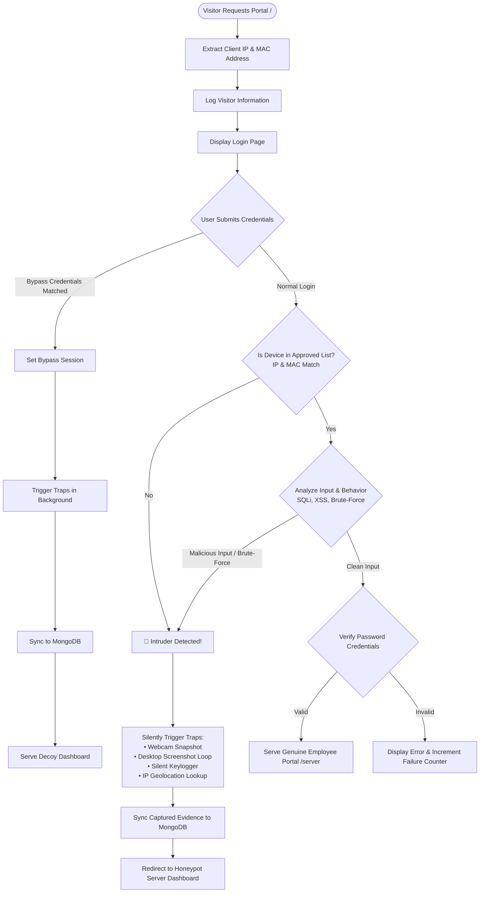

# 🛡️ WebLock – Advanced Intrusion Detection & Active Honeypot Security System

<p align="center">
  
</p>

<p align="center">
  <b>A real-time cybersecurity defense and active deception platform designed to detect, track, log, and neutralize unauthorized access attempts.</b>
</p>

<p align="center">
  
  
  
  
  
  
  
</p>

---

## 📑 Table of Contents
- [Overview](#-overview)
- [System Architecture & Workflow](#-system-architecture--workflow)
- [Key Features](#-key-features)
  - [1. Real-Time Intrusion Detection](#1-real-time-intrusion-detection)
  - [2. Active Honeypot & Decoy Traps](#2-active-honeypot--decoy-traps)
  - [3. Silent Forensic Evidence Gathering](#3-silent-forensic-evidence-gathering)
  - [4. IP Geolocation & Threat Mapping](#4-ip-geolocation--threat-mapping)
  - [5. Machine Learning Anomaly Detection](#5-machine-learning-anomaly-detection)
  - [6. Centralized MongoDB Pipeline](#6-centralized-mongodb-pipeline)
  - [7. Automated Forensic Reports & Alerting](#7-automated-forensic-reports--alerting)
- [Dashboards & Portals](#-dashboards--portals)
- [Project Structure](#-project-structure)
- [Prerequisites](#-prerequisites)
- [Installation & Setup](#-installation--setup)
- [Configuration](#-configuration)
- [Running WebLock](#-running-weblock)
- [Testing the Honeypot](#-testing-the-honeypot)
- [Distributed MongoDB Setup](#-distributed-mongodb-setup)
- [Ethical Disclaimer](#-ethical-disclaimer)
- [Credits](#-credits)

---

## 🌟 Overview

**WebLock** is an enterprise-grade cybersecurity monitoring and honeypot platform developed by **Team Sentinels**. Unlike passive firewalls that merely reject suspicious traffic, WebLock integrates **active deception**:

1. **Detects** malicious attempts (Brute Force, SQL Injection, XSS, and unauthorized devices).
2. **Deceives** intruders by routing them to a realistic decoy dashboard instead of raising immediate suspicion.
3. **Traps & Gathers Forensics** in the background by capturing webcam photos, desktop screenshots, keystrokes, and network parameters.
4. **Synchronizes** all intelligence in real time with a MongoDB cluster and generates forensic PDF incident reports with automated email alerts.

---

## 🏗️ System Architecture & Workflow



---

## 🚀 Key Features

### 1. Real-Time Intrusion Detection
* **Hardware & Network Fingerprinting**: Captures the visitor's real IPv4 address and active MAC address using `psutil` and public IP resolvers.
* **Device Whitelisting**: Compares device signatures against `approved_ips.json`. Unauthorized devices are flagged immediately.
* **SQL Injection & XSS Detection**: Scans incoming inputs against compiled regex rule sets (`sql_injection_patterns.json`, `xss_patterns.json`).
* **Sliding-Window Brute-Force Mitigation**: Tracks failed authentication timestamps within a configurable window (e.g., 5 attempts in 300 seconds) to detect credential stuffing.

### 2. Active Honeypot & Decoy Traps
* **Deceptive Redirection**: Suspects are seamlessly transitioned into a decoy "Server Manager Dashboard" (`dashboard.html`), making intruders believe their exploit was successful.
* **Invisible Trap Execution**: Honeypot scripts execute concurrently in background daemon threads without degrading server responsiveness.

### 3. Silent Forensic Evidence Gathering
* **Webcam Intruder Snapshot**: Utilizes `OpenCV` (`cv2.VideoCapture(0)`) to snap an image of whoever is at the computer when an unauthorized attempt occurs. Saved in `Capture/intruder/`.
* **Continuous Screenshot Surveillance**: Employs `PyAutoGUI` to capture automated screen grabs every 5 seconds, stored in `Capture/screenshots/`.
* **Background Keylogger**: Uses `pynput` to silently record keystrokes and key combinations into structured JSON records (`logs/key_logs.json`).

### 4. IP Geolocation & Threat Mapping
* Resolves public IPs into geographical coordinates (City, Region, Country, Latitude, Longitude, ISP) via Geolocation APIs.
* Records geographical coordinates into `logs/intruder_log.csv` for spatial analysis and global attack heatmap visualization.

### 5. Machine Learning Anomaly Detection
* Incorporates an **Isolation Forest** model (`model/ml_model.py`) via `scikit-learn` to identify anomalous login patterns and user behavioral outliers.
* Supports model serialization and persistence via `joblib`.

### 6. Centralized MongoDB Pipeline
* Automated bidirectional sync (`instance/database.py`) uploads:
  - Intruder event logs (`intruder_logs`)
  - Employee device records (`employee_logs`)
  - Recorded keystroke buffers (`keystrokes`)
  - Binary image & screenshot payloads (`captured_images`, `screenshots`)
  - Network telemetry (`network_logs`)
* De-duplication logic ensures records are never re-uploaded redundantly.

### 7. Automated Forensic Reports & Alerting
* **Automated PDF Reports**: Uses `fpdf` and `reportlab` to compile incident logs, geolocation data, and captured evidence into a comprehensive security audit report.
* **Email Breach Notifications**: Dispatches automated SMTP alerts containing incident summaries and attachments to configured security administrators.

---

## 🖥️ Dashboards & Portals

| Route | Template | Role / Purpose | Access Requirement |
| :--- | :--- | :--- | :--- |
| `/` | `login.html` | Portal Entry Gate | Public |
| `/server` | `server.html` | Authorized Employee Dashboard | Approved Device (IP + MAC) & Valid Credentials |
| `/dashboard` | `dashboard.html` | Honeypot Decoy Trap Dashboard | Intruders, Bypass Admins, or Trap Triggers |
| `/admin_dashboard` | `admindash.html` | Security Admin Control Center | Authenticated Dashboard Admin Session |

---

## 📁 Project Structure

```text
weblock/
├── app.py                      # Main Flask application & routing gateway
├── trap.py                     # Honeypot trap triggers (Webcam, Keylogger, Screenshots)
├── logs.py                     # CSV logging initialization utilities
├── HashConversion.py           # Password hashing & generation utility
├── requirements.txt            # Python dependencies
├── mongoprocess.md             # Remote / distributed MongoDB documentation
├── api.txt                     # API key configuration
│
├── model/                      # Detection rules, AI models, and access registries
│   ├── algorithm.py            # Authentication, brute-force & pattern inspection engine
│   ├── ml_model.py             # Isolation Forest anomaly detection model
│   ├── dataanalysis.py         # Network traffic monitoring, PDF reports & email alerts
│   ├── admin_settings.json     # Admin and bypass credentials
│   ├── approved_ips.json       # Whitelisted employee IP & MAC device directory
│   ├── data.json               # Registered user accounts
│   ├── brute_force_patterns.json # Thresholds and time-window rules
│   ├── sql_injection_patterns.json # Regex signatures for SQLi detection
│   └── xss_patterns.json       # Regex signatures for XSS detection
│
├── instance/
│   ├── database.py             # MongoDB synchronization & collection management
│   └── admin/                  # Administrative web assets
│       ├── admindash.html      # Security Admin Dashboard UI
│       ├── adminscript.js      # Dashboard dynamic charts & live data loaders
│       ├── adminstyle.css      # Admin styling theme
│       └── weblock.png         # WebLock branding asset
│
├── Templates/                  # Flask HTML templates
│   ├── login.html              # Modern dark-mode portal login interface
│   ├── dashboard.html          # Honeypot decoy dashboard (Server Manager)
│   └── server.html             # Authorized employee workspace
│
├── static/                     # Static styling and frontend scripts
│   ├── css/
│   └── js/
│
├── logs/                       # Local structured security logs
│   ├── intruder_log.csv        # Incident timestamps, IPs, geolocations & ISPs
│   ├── login_log.csv           # Device connection audit trail
│   └── key_logs.json           # Time-indexed captured keystrokes
│
└── Capture/                    # Forensic media storage
    ├── intruder/               # Webcam photos of intruders (.jpg)
    └── screenshots/            # Automated screen recordings (.png)
```

---

## ⚙️ Prerequisites

1. **Operating System**: Windows 10/11 recommended (required for native `psutil` MAC retrieval, `pyautogui`, and `pynput` keyboard hooks).
2. **Python**: Python 3.8+ (Python 3.10 recommended).
3. **MongoDB**: Local MongoDB instance (`mongodb://localhost:27017`) or remote MongoDB service.
4. **Hardware**: A working webcam connected for intruder photography.

---

## 📥 Installation & Setup

### 1. Clone or Open the Repository
```bash
cd c:\Users\poojitha\Desktop\weblock
```

### 2. Create and Activate a Virtual Environment
```powershell
# Create virtual environment
python -m venv venv

# Activate virtual environment (Windows PowerShell)
.\venv\Scripts\Activate.ps1
```

### 3. Install Dependencies
```bash
pip install -r requirements.txt
```

> **Note**: If `pyautogui` or `pynput` prompt for missing prerequisites on your environment, ensure your graphics and display drivers are properly configured.

### 4. Start MongoDB
Ensure MongoDB is running locally on port `27017`:
```cmd
net start MongoDB
```
Or start the daemon manually:
```cmd
mongod --port 27017 --bind_ip 127.0.0.1
```

---

## 🔧 Configuration

### 1. Geolocation API Key
WebLock uses the `ipgeolocation.io` API for geographic profiling:
- Place your API key in `api.txt` or configure it directly in `trap.py`:
  ```python
  API_KEY = "your_ipgeolocation_api_key"
  ```

### 2. Whitelisted Devices (`model/approved_ips.json`)
Register trusted employee devices with their IP and MAC addresses:
```json
{
  "approved_devices": [
    {
      "name": "Authorized User",
      "employee_id": "EMP101",
      "ip_address": "192.168.1.100",
      "mac_address": "AA-BB-CC-DD-EE-FF"
    }
  ]
}
```

### 3. Admin & Bypass Users (`model/admin_settings.json`)
Configure administrative accounts:
```json
{
  "admin_users": [
    {
      "username": "cyber",
      "password": "your_secure_password"
    }
  ],
  "bypass_access": [
    {
      "username": "admin",
      "password": "your_bypass_password"
    }
  ]
}
```

### 4. Alert Email Credentials (`model/dataanalysis.py`)
To enable incident emails:
```python
sender_email = "your_alert_email@gmail.com"
receiver_email = "admin_security@domain.com"
email_password = "your_app_password"
```

---

## 🏃 Running WebLock

### 1. Start the WebLock Web Platform
```powershell
python app.py
```
* Output will confirm MongoDB synchronization:
  ```text
  🚀 Uploading existing data to MongoDB on startup...
  ✅ Data upload complete. WebLock is running.
  🚀 WebLock is starting...
  * Running on http://127.0.0.1:5000/ (Press CTRL+C to quit)
  ```

### 2. Run Network Traffic Monitoring & Forensic Alerting (Optional)
To initiate network I/O tracking and periodic report generation:
```powershell
python model/dataanalysis.py
```

### 3. Train or Run the ML Anomaly Detection Model (Optional)
To fit the Isolation Forest model on login history:
```powershell
python model/ml_model.py
```

---

## 🧪 Testing the Honeypot

To test whether traps activate correctly:

1. Open your browser and navigate to `http://localhost:5000/`.
2. Attempt to log in with an unauthorized username or unapproved device.
3. Observe the system behavior:
   - The user is redirected to `http://localhost:5000/dashboard` (Decoy Server Manager).
   - In the console, traps trigger:
     ```text
     🚨 Intruder detected! Executing traps...
     📸 Intruder Image Captured: Capture/intruder/...jpg
     🖼 Screenshot Saved: Capture/screenshots/...png
     ⌨ Keylogger started: logs/key_logs.json
     ```
4. Verify created media in `Capture/intruder/`, `Capture/screenshots/`, and `logs/intruder_log.csv`.
5. Check your MongoDB collections (`WebLock-db`) to confirm documents have synced.

---

## 🌐 Distributed MongoDB Setup

For multi-host enterprise environments (e.g., dedicated database server and separate analysis workstation), refer to the comprehensive guide in:
📄 **[`mongoprocess.md`](mongoprocess.md)**

It details:
- Binding MongoDB across external network interfaces (`bind_ip 0.0.0.0`)
- Configuring firewall ports (`27017`)
- Remote client connections using `pymongo`

---

## ⚖️ Ethical & Legal Disclaimer

> [!WARNING]
> **WebLock** includes proactive surveillance mechanisms including automated keystroke capture, screen grabbing, and webcam access.
> 
> * These capabilities are strictly designed for **authorized honeypot deployments, security research, cyber defense education, and controlled laboratory environments**.
> * Unauthorized deployment, keystroke surveillance, or image capture without explicit prior consent is strictly prohibited and may violate local and international laws.
> * Always ensure full legal compliance and appropriate user notices before deploying in production environments.

---

## 👥 Credits

Developed with dedication by **Team Sentinels**:
* Built with **Python**, **Flask**, **OpenCV**, and **MongoDB**.
* Designed to empower ethical hackers, incident responders, and cybersecurity analysts with active threat intelligence.
